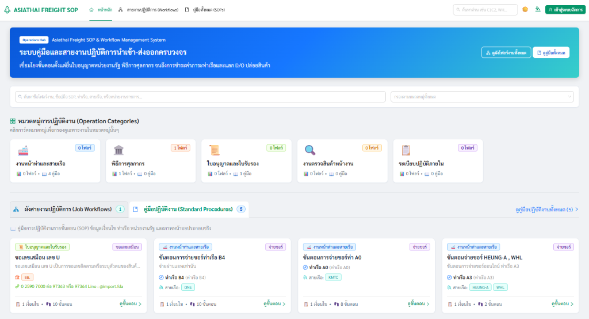

# 🌐 Asiathai Freight SOP & Workflow Management System
### ระบบคู่มือและสายงานปฏิบัติการนำเข้า-ส่งออกครบวงจร



> **ศูนย์รวมฐานความรู้และแผนผังสายงานปฏิบัติการโลจิสติกส์แบบ End-to-End**  
> เชื่อมโยงขั้นตอนตั้งแต่การขอใบอนุญาตหน่วยงานรัฐ, พิธีการศุลกากร, การตรวจปล่อยสินค้าหน้าด่าน จนถึงการชำระค่าภาระท่าเรือและการแลกใบสั่งปล่อยสินค้า (D/O) กับสายเรือ ออกแบบมาเพื่อลดความซับซ้อน ป้องกันข้อผิดพลาดหน้างาน และเป็นมาตรฐานการปฏิบัติการเดียวกันทั้งองค์กร

---

## 📌 1. ความเป็นมาและความสำคัญ (Executive Summary)

ในธุรกิจการนำเข้า-ส่งออกและตัวแทนออกของ (Freight Forwarding & Customs Brokerage) แต่ละกระบวนการมีความเชื่อมโยงกับหลายหน่วยงาน ทั้งหน่วยงานราชการผู้ออกใบอนุญาต, กรมศุลกากร, ท่าเรือพาณิชย์ และตัวแทนสายเรือ การจัดการเอกสารแบบเดิม (เช่น สมุดคู่มือ Word / ตาราง Excel / โน้ตในไลน์กลุ่ม) มักทำให้ข้อมูลกระจัดกระจาย ไม่เป็นปัจจุบัน และพนักงานหน้างานมองไม่เห็นภาพรวมของสายงาน

ระบบ **Asiathai Freight SOP & Workflow Management System** จึงได้รับการพัฒนาขึ้นเพื่อเป็น **Single Source of Truth** ที่รวมทั้ง **"คู่มือวิธีทำทีละสเต็ป (SOPs)"** และ **"แผนผังสายงานร้อยเรียงขั้นตอน (Job Workflows)"** เข้าด้วยกันอย่างสมบูรณ์:

| มิติการเปรียบเทียบ | วิธีการเดิม (Word / Excel / เอกสารกระดาษ) | ระบบ Asiathai Freight SOP System |
| :--- | :--- | :--- |
| **ขอบเขตการทำงาน (Coverage)** | แยกเล่ม กระจัดกระจายตามแผนก ใครทำใครรู้ | ครอบคลุมครบวงจร: ใบอนุญาตราชการ, ศุลกากร, หน้าท่าเรือ, สายเรือ, งานภายใน |
| **การมองเห็นภาพรวม (Workflow Vision)** | ไม่เห็นความต่อเนื่องระหว่างขั้นตอน พนักงานหน้างานสับสน | มี **Mindmap Flowchart** ร้อยเรียงขั้นตอน 1 $\rightarrow$ 2 $\rightarrow$ 3 พร้อมระบบงานคู่ขนาน (Parallel) และจุดรวมงาน |
| **ความสะดวกในการค้นหาหน้างาน** | ต้องเปิดหาทีละไฟล์ ใช้เวลามากเวลาเร่งด่วน | ค้นหาด่วน (Quick Search) หรือคลิกกรองตามหมวดหมู่ พบขั้นตอนที่ต้องการภายในไม่กี่วินาที |
| **การแสดงภาพและขั้นตอน** | รูปภาพหลุดกรอบ เอกสารบวม เปิดในมือถือช้า | Step-by-Step พร้อมรูปภาพความละเอียดสูงจาก MinIO คลิกขยายดูภาพหน้าจอจริง (Lightbox Zoom) ได้ทันที |
| **การรองรับสถานการณ์พิเศษ (Variants)** | สับสนเมื่อมีข้อยกเว้นหรือระบบล่ม | มีระบบแยกเงื่อนไข (Variants) เช่น สภาวะปกติ (ออนไลน์) / สภาวะระบบขัดข้อง / ยื่นหน้าท่า |
| **ความเข้ากันได้กับอุปกรณ์ (Mobility)** | ดูผ่านโทรศัพท์มือถือหน้างานยากมาก | Responsive Design พร้อม Ant Design Compact Mode แสดงผลสบายตา รองรับทั้งมือถือ แท็บเล็ต และคอมพิวเตอร์ |

---

## 🗂️ 2. หมวดหมู่การปฏิบัติงานหลัก (Operation Categories)

ระบบครอบคลุม 5 เสาหลักของการปฏิบัติการโลจิสติกส์นำเข้า-ส่งออก:

```
┌────────────────────────────────────────────────────────────────────────────────────────┐
│                     Asiathai Freight Operations Hub (5 หมวดหมู่งานหลัก)                │
└────────────────────────────────────────────────────────────────────────────────────────┘
       │                      │                      │                   │              │
       ▼                      ▼                      ▼                   ▼              ▼
┌──────────────┐      ┌──────────────┐      ┌────────────────┐  ┌─────────────┐  ┌─────────────┐
│ 🚢 งานหน้าท่า  │      │ 🏛️ พิธีการ    │      │ 📜 ใบอนุญาตและ │  │ 🔍 งานตรวจ  │  │ 📑 ระเบียบ  │
│   และสายเรือ │      │    ศุลกากร   │      │    ใบรับรอง    │  │ สินค้าหน้างาน│  │ ปฏิบัติภายใน│
├──────────────┤      ├──────────────┤      ├────────────────┤  ├─────────────┤  ├─────────────┤
│• จ่ายชอร์    │      │• จัดทำใบขน   │      │• ขอเลขเสมือน (U│  │• เอ็กซเรย์   │  │• การเบิกจ่าย│
│• วางบิลมัดจำ │      │• ชำระภาษี    │      │• ใบอนุญาต อย.  │  │• เปิดตรวจร่วม│  │• ประสานงาน  │
│• e-Portal    │      │• ตรวจปล่อย   │      │• กรมวิชาการเกษตร│ │• ด่านกักกัน   │  │• ตรวจสอบ    │
│• แลก D/O     │      │• กรมศุลกากร  │      │• ปศุสัตว์/สมอ. │  │  พืช/สัตว์   │  │  เอกสาร     │
└──────────────┘      └──────────────┘      └────────────────┘  └─────────────┘  └─────────────┘
```

1. **🚢 งานหน้าท่าและสายเรือ (Terminal & Shipping Lines):** การจ่ายชอร์, วางบิลมัดจำตู้, ชำระค่าภาระผ่าน e-Portal, แลกใบสั่งปล่อยสินค้า (D/O) กับสายเรือ
2. **🏛️ พิธีการศุลกากร (Customs Procedures):** การบันทึกและส่งใบขนสินค้าขาเข้า-ขาออก, การชำระภาษีอากรศุลกากร, พิธีการเปิดตรวจ
3. **📜 ใบอนุญาตและใบรับรอง (Government Agencies & Licenses):** การขอเลขเสมือน (U Number), การขอใบอนุญาตนำเข้า อย. (LPI), กรมวิชาการเกษตร (พ.ก.5), กรมปศุสัตว์, กรมประมง, สมอ.
4. **🔍 งานตรวจสินค้าหน้างาน (Physical Cargo Inspection):** การเอ็กซเรย์ตู้สินค้า, การเปิดตรวจร่วมหน้าด่าน (Joint Inspection), เจ้าหน้าที่ด่านตรวจปล่อย
5. **📑 ระเบียบปฏิบัติภายใน (Internal Operations):** มาตรฐานขั้นตอนเอกสารภายในบริษัท, การสำรองเงินจ่าย, การส่งต่องานระหว่างชิปปิ้งกับฝ่าย CS

---

## 🧩 3. สองโมดูลหลักที่ทำงานร่วมกัน (Core Integrated Modules)

### 🌿 โมดูลที่ 1: ผังสายงานปฏิบัติการ (Job Workflows & Interactive Mindmap)
* **End-to-End Flowcharts:** แผนผังร้อยเรียงขั้นตอนตั้งแต่ต้นจนจบกระบวนการ (เช่น *สายงานการจัดการค่าภาระหน้าท่าและแลกใบปล่อยสินค้า D/O & จ่ายชอร์*)
* **Multi-Branching & Join Flows:**
  * รองรับขั้นตอนตามลำดับปกติ (Sequential: 1 $\rightarrow$ 2 $\rightarrow$ 3)
  * รองรับขั้นตอนที่ทำพร้อมกัน (Parallel Execution: แตกกิ่งซ้าย-ขวา เช่น ทำเรื่อง e-Portal พร้อมยื่นขอใบอนุญาต)
  * รองรับขั้นตอนที่ต้องรอให้หลายงานเสร็จก่อน (Fork & Join / Merge Flow: รวมสายงานกลับมาที่กล่องเดียว)
* **Draggable & Auto-Layout:** สามารถคลิกลากย้ายตำแหน่งกล่องได้อย่างอิสระ หรือกดปุ่ม **"จัดผังอัตโนมัติ"** เพื่อจัดระเบียบกลับสู่ทรงสมมาตร
* **Auto-Fill Data Linking:** เมื่อเลือกผูกขั้นตอนกับคู่มือ SOP ระบบจะดึงชื่อขั้นตอน, คำอธิบายย่อ, หน่วยงานรัฐ และท่าเรือลงฟอร์มให้อัตโนมัติทันที
* **Dual View Mode:** สลับดูได้ทั้งมุมมอง **ผังงาน (Mindmap Flow)** และ **ตารางเช็คลิสต์ (Table Checklist)**

### 📖 โมดูลที่ 2: คู่มือปฏิบัติงานมาตรฐานรายขั้นตอน (Standard Operating Procedures - SOPs)
* **SOP Builder & Step-by-Step Viewer:** บันทึกขั้นตอนการปฏิบัติงานละเอียด 1, 2, 3 พร้อมหัวข้อ, วิธีปฏิบัติ และผู้รับผิดชอบ
* **Multi-Variants Handling:** แยกเงื่อนไขกรณีพิเศษในคู่มือเล่มเดียวกัน เช่น สภาวะปกติ (ออนไลน์), กรณีระบบขัดข้อง, หรือกำหนดยื่นหน้าท่า
* **Cut-off Time & Hotline Alert:** แสดงเวลาตัดรอบงาน และเบอร์ติดต่อสายด่วนฉุกเฉินเด่นชัด
* **High-Res Step Screenshots:** แนบภาพหน้าจอจริงพร้อมคำบรรยาย และระบบขยายภาพขนาดใหญ่ (Lightbox Zoom Modal)

---

## 🛠️ 4. สถาปัตยกรรมและเทคโนโลยี (Technology Stack)

| ส่วนของระบบ | เทคโนโลยีที่เลือกใช้ | รายละเอียดและความเหมาะสม |
| :--- | :--- | :--- |
| **Frontend** | React 18 + TypeScript + Vite | พัฒนาด้วย Vite รวดเร็ว ทันสมัย โครงสร้าง Type-Safe 100% |
| **UI Library** | Ant Design 5 (Compact Mode) | ดีไซน์สไตล์ Compact แน่นกระชับ เหมาะกับงานเอกสารและตารางข้อมูลจำนวนมาก |
| **Mindmap Flow** | @xyflow/react (React Flow 12) | เอนจินผังงานรองรับ Drag & Drop, SmoothStep Curves, ปรับพิกัดแบบไดนามิก |
| **Backend Runtime** | Bun 1.2 (Alpine) | รัน TypeScript ในตัว เร็วกว่า Node.js หลายเท่า และประหยัด Memory สูง |
| **Backend Framework**| Hono Framework | Ultra-fast Web Framework เบา ประสิทธิภาพสูง Prefix `/api/` สอดคล้องกับ Nginx |
| **Database & ORM** | PostgreSQL 17 + Drizzle ORM | ฐานข้อมูลเสถียรภาพสูง จัดการความสัมพันธ์แบบ Relational ด้วย Drizzle Type-safe ORM |
| **Object Storage** | MinIO S3-Compatible Storage | จัดเก็บไฟล์ภาพหน้าจอและเอกสารแบบ Private Bucket ป้องกันฐานข้อมูลบวม |
| **Web Server / Proxy** | Nginx (Alpine) | Reverse Proxy รวม Web UI, API, และ File Stream ไว้ที่พอร์ตเดียวอย่างปลอดภัย |
| **Containerization** | Docker Compose | ติดตั้งและย้ายเซิร์ฟเวอร์ได้ด้วยคำสั่งเดียว รองรับทั้ง Windows, Linux และ macOS |

---

## 🔌 5. มาตรฐานพอร์ตเครือข่าย (Port Mapping - Strict 320X Standard)

เพื่อความเป็นระเบียบและป้องกันการชนกับบริการอื่นบน Host Server:

| Service | Host Port | Internal Port | วัตถุประสงค์การใช้งาน |
| :--- | :--- | :--- | :--- |
| **PostgreSQL** | `3200` | `5432` | พอร์ตจัดการ Database ภายนอก / Drizzle Studio / Backup |
| **MinIO API** | `3201` | `9000` | ระบบรับ-ส่งไฟล์ภายใน (S3 Backend Service) |
| **Nginx (Web UI)** | **`3202`** | `80` | **พอร์ตหลักสำหรับผู้ใช้งานและแอดมินเข้าใช้งานระบบ (Web Dashboard & API)** |
| **MinIO Console** | `3203` | `9001` | หน้าจอ Web GUI สำหรับ Admin จัดการ Storage Bucket |

---

## 🏗️ 6. โครงสร้างโปรเจกต์ (Project Structure)

```text
shore-procedure/
├── docker-compose.yml       # Docker Compose Orchestration (5 บริการ)
├── .env.example             # ตัวแปรสภาพแวดล้อมตัวอย่าง
├── README.md                # เอกสารคู่มือระบบฉบับสมบูรณ์
├── docs/
│   └── banner.png           # ภาพแบนเนอร์ระบบสำหรับเอกสาร
├── nginx/
│   └── conf.d/default.conf  # Nginx Reverse Proxy Route Configuration
├── frontend/
│   ├── Dockerfile
│   ├── package.json
│   ├── vite.config.ts
│   ├── public/              # Static Assets (banner, favicon)
│   └── src/
│       ├── components/      # WorkflowMindmapView, ProcedureCard, StepViewer, etc.
│       ├── contexts/        # ThemeContext (Dark/Light Mode & Primary Color)
│       ├── pages/           # HomePage, WorkflowListPage, WorkflowDetailPage, ProcedureDetailPage
│       ├── services/        # Axios API Client, AuthService
│       └── types/           # TypeScript Types & Interfaces
└── backend/
    ├── Dockerfile
    ├── package.json
    ├── drizzle.config.ts
    ├── drizzle/             # Database Migration SQL files
    └── src/
        ├── index.ts         # Hono Application Entrypoint
        ├── db/              # Drizzle Schema, Connections, Seeders (seed.ts, seedWorkflows.ts)
        ├── middleware/      # Auth & RBAC Middleware
        ├── routes/          # /api/workflows, /api/procedures, /api/categories, /api/files
        └── services/        # MinIO S3 Service & Stream Helpers
```

---

## ⚙️ 7. การติดตั้งและเริ่มต้นใช้งาน (Installation & Setup)

### 1) การเตรียมไฟล์ Environment
```bash
# คัดลอกไฟล์ .env จากตัวอย่าง
cp .env.example .env
```

### 2) สั่งรันระบบผ่าน Docker Compose
```bash
# 1. สั่ง build และ start คอนเทนเนอร์ทั้งหมด
docker compose up -d --build

# 2. รัน Database Migration & Seed ข้อมูลเริ่มต้น
docker compose exec backend bun run db:migrate
docker compose exec backend bun run db:seed
docker compose exec backend bun run src/db/seedWorkflows.ts

# 3. ตรวจสอบสถานะการทำงาน
docker compose ps
```
เมื่อรันเสร็จสิ้น สามารถเปิดใช้งานผ่านเว็บเบราว์เซอร์ได้ทันทีที่: **`http://localhost:3202`**

---

## 🔄 8. คู่มือการอัปเดตระบบและการจัดการฐานข้อมูล (Maintenance & Database Guide)

### 1) การอัปเดตโค้ดและระบบล่าสุด (Update Code from Git)
เมื่อมีการเพิ่มฟีเจอร์หรือแก้ไขโค้ดจาก Git Repository ให้รันตามลำดับดังนี้:
```bash
# 1. ดึงโค้ดล่าสุดจาก GitHub
git pull origin main

# 2. สั่ง Rebuild คอนเทนเนอร์ (ข้อมูลใน Postgres และ MinIO ปลอดภัย ไม่สูญหาย)
docker compose up -d --build

# 3. อัปเดตโครงสร้างฐานข้อมูลล่าสุด
docker compose exec backend bun run db:migrate

# 4. รีสตาร์ท Nginx เพื่อเคลียร์แคชและรีเฟรชการตั้งค่า
docker restart shore-nginx
```

---

### 2) การสำรองข้อมูล (Backup) และกู้คืนข้อมูล (Restore) ฐานข้อมูล PostgreSQL

#### 📤 คำสั่ง Backup (สร้างไฟล์ `.sql` จากเซิร์ฟเวอร์ต้นทาง):
```bash
docker exec -t shore-postgres pg_dump -U shore_app shore_db > backup_shore.sql
```
*(จะได้ไฟล์ `backup_shore.sql` ในโฟลเดอร์โปรเจกต์)*

#### 📥 คำสั่ง Restore (นำเข้าไฟล์ `.sql` สู่เซิร์ฟเวอร์ปลายทาง):
* **สำหรับ Windows PowerShell:**
  ```powershell
  Get-Content backup_shore.sql | docker exec -i shore-postgres psql -U shore_app -d shore_db
  ```
* **สำหรับ Linux / Mac / Git Bash:**
  ```bash
  cat backup_shore.sql | docker exec -i shore-postgres psql -U shore_app -d shore_db
  ```

---

### 3) การเติมข้อมูลตัวอย่างเริ่มต้น (Data Seeding)
```bash
# เติม Master Data (ท่าเรือ, เอเย่นต์, หมวดหมู่, หน่วยงานรัฐ, คู่มือ SOP)
docker compose exec backend bun run db:seed

# เติมสายงานปฏิบัติการและขั้นตอน Flowchart (Job Workflows & Steps)
docker compose exec backend bun run src/db/seedWorkflows.ts
```

---

### 4) คำสั่งตรวจสอบและดูแลรักษาระบบ (Troubleshooting Commands)
```bash
# ตรวจสอบสถานะคอนเทนเนอร์ทั้งหมด
docker compose ps

# ดู Log ของ Backend แบบ Real-time
docker compose logs -f backend

# ดู Log ของ Frontend และ Nginx
docker compose logs -f frontend nginx

# รีสตาร์ทเฉพาะบริการที่มีปัญหา
docker compose restart backend frontend shore-nginx

# ปิดระบบทั้งหมด (ข้อมูลยังคงปลอดภัยใน Docker Named Volumes)
docker compose down
```

> [!NOTE]
> **ความปลอดภัยของข้อมูล (Data Persistence Guarantee):**  
> ข้อมูลทั้งหมดใน PostgreSQL และไฟล์ภาพใน MinIO ถูกผูกไว้กับ Named Volumes (`postgres_data`, `minio_data`) ใน `docker-compose.yml` ข้อมูลจะไม่สูญหายเมื่อสั่ง `docker compose down` หรือ `docker compose up -d --build`

---

## 🔒 9. ความปลอดภัยและการจัดการไฟล์ (Security & File Storage)

1. **Private Storage by Default:** บักเก็ต MinIO `shore-procedures` ถูกกำหนดเป็น Private (`anonymous set none`) บุคคลภายนอกไม่สามารถเข้าถึงไฟล์โดยตรงได้
2. **Backend Streaming Endpoint:** Frontend ดึงรูปภาพผ่าน `/api/files/steps/:imageId` โดย Backend จะทำการตรวจสอบสิทธิ์และสตรีมไฟล์จาก MinIO ให้ เพื่อซ่อนระบบจัดเก็บไฟล์จริง
3. **Role-Based Access Control (RBAC):**
   * **พนักงานทั่วไป (User):** เข้าดูคู่มือและผังสายงานได้ทุกคน (Read-Only)
   * **ผู้ดูแลระบบ (Admin / Supervisor):** สามารถเพิ่ม ลบ แก้ไขคู่มือ, สร้างผังงาน, และจัดการ Master Data ได้

---

## 📋 10. แผนการพัฒนาต่อยอด (Future Roadmap)

- [ ] **Export Mindmap as Image (PNG / PDF):** ปุ่มดาวน์โหลดรูปภาพผังสายงานความละเอียดสูง สำหรับแชร์เข้าไลน์กลุ่มชิปปิ้ง
- [ ] **Step SLA & Duration:** ระบุเวลาโดยประมาณและผู้รับผิดชอบเจาะจงในแต่ละขั้นตอน
- [ ] **Job Checklist Execution Mode:** โหมดติ๊กถูกบันทึกสถานะการดำเนินงานจริงรายตู้สินค้า
- [ ] **Command Palette (Ctrl + K):** ค้นหาด่วนข้ามหมวดหมู่แบบ Instant Search
- [ ] **Offline / PWA Support:** แคชขั้นตอนและคู่มือที่เปิดบ่อยไว้ดูยามสัญญาณเน็ตหน้าท่าเรือขัดข้อง
