# 🚢 Shore Procedure Management System (ระบบจัดการขั้นตอนและคู่มือการจ่ายชอร์)

> ระบบจัดการฐานความรู้และขั้นตอนการปฏิบัติงานการจ่ายชอร์แบบรวมศูนย์ ออกแบบมาเพื่อลดความซับซ้อน ป้องกันข้อผิดพลาดหน้างาน และทดแทนการจัดการเอกสารแบบเดิม (Word / Excel) ด้วยเว็บแอปพลิเคชันที่ค้นหาง่าย รวดเร็ว และเป็นมาตรฐานเดียวกันทั้งองค์กร

---

## 📌 1. ความเป็นมาและความสำคัญ (Executive Summary)

### ทำไมถึงเลือกทำเป็น Web Application แทน Excel / Word?
ในการปฏิบัติงานจ่ายชอร์ แต่ละท่าเรือและเอเย่นต์มีขั้นตอน กฎระเบียบ เงื่อนไขเฉพาะ และข้อควรระวังที่แตกต่างกันมาก การใช้เอกสาร Word หรือไฟล์ Excel แบบเดิมพบปัญหาสำคัญดังนี้:

| มิติการเปรียบเทียบ | เอกสารเดิม (Word / Excel / ไลน์กลุ่ม) | ระบบเว็บแอปพลิเคชัน (Shore System) |
| :--- | :--- | :--- |
| **ความถูกต้องของข้อมูล (Single Source of Truth)** | มีหลายเวอร์ชัน ไฟล์กระจัดกระจาย ไม่รู้ว่าไฟล์ไหนล่าสุด | ข้อมูลรวมศูนย์ที่เดียว อัปเดตครั้งเดียวทุกคนเห็นตรงกันทันที |
| **ความสะดวกในการค้นหาหน้างาน** | ต้องเปิดหาทีละไฟล์ หรือเลื่อนหาในชีตที่ซับซ้อน ใช้เวลามาก | กรองตาม **ท่าเรือ + เอเย่นต์ + เงื่อนไข** เจอขั้นตอนใน 3 คลิก หรือค้นหาด่วนได้ทันที |
| **การแสดงภาพประกอบและขั้นตอน** | ใส่รูปใน Word/Excel ไฟล์จะใหญ่ ช้า รูปภาพแตกหรือหลุดกรอบ | ระบบจัดเรียง Step-by-Step พร้อมรูปภาพความละเอียดสูง คลิกซูมดูรูปตัวอย่างได้ชัดเจน |
| **การจัดการกรณีพิเศษ (Variants)** | สับสนเมื่อมีเงื่อนไขแตกย่อย (เช่น งานปกติ / ระบบขัดข้อง / ยื่นหน้าท่า) | มีระบบเงื่อนไข (Variants) แยกชัดเจนตามสถานการณ์จริง |
| **การควบคุมสิทธิ์ (Security & Audit)** | ใครก็สามารถแก้ไขหรือเผลอลบสูตร/ข้อความในไฟล์ได้ | แยกสิทธิ์ชัดเจน: พนักงานทั่วไปดูได้อย่างเดียว (Read-Only) / แอดมินเป็นผู้แก้ไข |
| **การรองรับอุปกรณ์ (Mobility)** | ดูบนมือถือหรือแท็บเล็ตหน้างานลำบาก | Responsive ออกแบบรองรับการเปิดดูผ่านสมาร์ตโฟนและแท็บเล็ตหน้าท่าเรือ |

---

## 🎯 2. วัตถุประสงค์ของระบบ (Objectives)

1. **เป็นคลังคู่มือปฏิบัติงานมาตรฐาน (Standard Operating Procedure - SOP):** รวบรวมวิธีจ่ายชอร์ของทุกท่าเรือและทุกเอเย่นต์ไว้ในที่เดียว
2. **ลดความผิดพลาดและลดเวลาเทรนนิ่งพนักงานใหม่:** มีลำดับขั้นตอน 1, 2, 3 พร้อมภาพประกอบหน้าจอจริง ทำให้พนักงานใหม่ทำงานได้ถูกต้องทันที
3. **รับมือกับสถานการณ์ไม่ปกติได้รวดเร็ว:** มีขั้นตอนรองรับกรณีระบบขัดข้อง หรือกรณีเร่งด่วน พร้อมเวลาตัดรอบ (Cut-off Time) และช่องทางติดต่อฉุกเฉิน
4. **ความพร้อมในการตรวจสอบ (Audit-Ready):** มีบันทึกประวัติการปรับปรุงคู่มือ วันที่อัปเดตล่าสุด และผู้รับผิดชอบ

---

## 🛠️ 3. สถาปัตยกรรมและเทคโนโลยี (Technology Stack)

เลือกใช้ชุดเทคโนโลยีสมัยใหม่ที่เน้น **ความเร็วสูง (High Performance), ประหยัดทรัพยากร (Resource Efficient), และดูแลรักษาง่าย (Low Maintenance)**:

| ส่วนของระบบ | เทคโนโลยีที่เลือกใช้ | เหตุผลความเหมาะสม |
| :--- | :--- | :--- |
| **Frontend** | React 18/19 + TypeScript + Vite + Ant Design (Compact Mode) | แสดงผลแบบ Compact Table แน่นกระชับ เหมาะกับระบบงานเอกสาร ค้นหาข้อมูลได้ไว |
| **Backend Runtime** | Bun | รัน TypeScript ได้ในตัว ทำงานได้เร็วกว่า Node.js ประหยัดแรมสูง |
| **Backend Framework**| Hono | Ultra-fast Web Framework เบา ไม่ซับซ้อน และรองรับ RESTful API แบบ Type-safe |
| **Database & ORM** | PostgreSQL 17 + Drizzle ORM | ฐานข้อมูล Relational ที่เสถียรสูง รองรับความสัมพันธ์หลายชั้น พร้อม ORM แบบ Type-safe |
| **Object Storage** | MinIO (S3-Compatible) | สำหรับเก็บรูปภาพหน้าจอและเอกสารแนบแบบ Private แยกจาก Database ป้องกัน DB บวม |
| **Web Server / Proxy** | Nginx Alpine | ทำ Reverse Proxy รวม Frontend, Backend API และระบบ Serving รูปภาพไว้ที่พอร์ตเดียว |
| **Deployment** | Docker Compose | ติดตั้งและย้ายเซิร์ฟเวอร์ได้ง่ายด้วยคำสั่งเดียว ไม่ติดปัญหา Environment ไม่ตรงกัน |

---

## 🔌 4. มาตรฐานพอร์ตเครือข่าย (Port Mapping - 320X Standard)

เพื่อความเป็นระเบียบและไม่ชนกับบริการอื่นบน Host Server:

| Service | Host Port | Internal Port | วัตถุประสงค์ |
| :--- | :--- | :--- | :--- |
| **PostgreSQL** | `3200` | `5432` | สำหรับต่อจัดการ Database ภายนอก / Drizzle Studio |
| **MinIO API** | `3201` | `9000` | ระบบรับ-ส่งไฟล์ภายใน (Backend Service) |
| **Nginx (Web UI)** | **`3202`** | `80` | **พอร์ตหลักสำหรับผู้ใช้งานและแอดมินเข้าใช้งานระบบ** |
| **MinIO Console** | `3203` | `9001` | หน้าจอ Web GUI สำหรับ Admin จัดการ Storage Bucket |

---

## 🔄 5. ขั้นตอนการทำงานของระบบ (Workflow)

```mermaid
flowchart TD
    subgraph UserFlow["🧑‍💻 Flow การใช้งานของพนักงานหน้างาน (User)"]
        A([เข้าสู่ระบบ http://localhost:3202]) --> B[ค้นหาด่วน หรือ เลือก ท่าเรือ + เอเย่นต์]
        B --> C[เลือกลักษณะงาน / เงื่อนไข เช่น ปกติ, ระบบขัดข้อง]
        C --> D[แสดงผลข้อมูลแบบ Compact Card / Table]
        D --> D1[ข้อมูลสำคัญ: วิธีจ่าย / เวลาตัดรอบ / ข้อควรระวัง]
        D --> D2[ขั้นตอนทีละ Step 1, 2, 3 พร้อมภาพประกอบความละเอียดสูง]
        D2 --> E([คลิกขยายดูภาพหน้าจอขนาดใหญ่])
    end

    subgraph AdminFlow["⚙️ Flow การจัดการของแอดมิน (Admin / Supervisor)"]
        F([เข้าสู่ระบบ Admin Console]) --> G[จัดการ Master Data: ท่าเรือ, เอเย่นต์, ประเภทงาน]
        G --> H[สร้าง/แก้ไขคู่มือ Procedure Builder]
        H --> H1[เลือก ท่าเรือ + เอเย่นต์ + งาน]
        H1 --> H2[กำหนดเงื่อนไข Variants เช่น สภาวะปกติ / สภาวะฉุกเฉิน]
        H2 --> H3[เพิ่มขั้นตอน Steps & เรียงลำดับ]
        H3 --> H4[อัปโหลดรูปภาพหน้าจอลง MinIO อัตโนมัติ]
        H4 --> I([บันทึกและ Publish คู่มือให้พนักงานใช้งานทันที])
    end
```



---

## 🗄️ 6. โครงสร้างฐานข้อมูล (Database Schema)

โครงสร้างฐานข้อมูลออกแบบตามหลัก Normalized และรองรับกรณีความหลากหลายของหน้างานจริง:
- **1 ท่าเรือ** รองรับได้หลายเอเย่นต์
- **1 คู่มือ (Procedure)** สามารถแตกได้หลายเงื่อนไข (**Variants**) เช่น สภาวะปกติ, เซิร์ฟเวอร์ล่ม, ต้องใช้เอกสารจริง
- **1 เงื่อนไข** ประกอบด้วยขั้นตอนตามลำดับ (**Steps**)
- **1 ขั้นตอน** สามารถแนบรูปภาพได้หลายรูป (**Step Images**)

```typescript
import { pgTable, serial, text, integer, timestamp, boolean, uniqueIndex, index } from 'drizzle-orm/pg-core';

// 1. ตารางรายชื่อท่าเรือ (Ports)
export const ports = pgTable('ports', {
  id: serial('id').primaryKey(),
  code: text('code').notNull().unique(), // เช่น 'C1C2', 'B3'
  name: text('name').notNull(),          // เช่น 'ท่าเรือแหลมฉบัง C1C2'
  isActive: boolean('is_active').default(true).notNull(),
  createdAt: timestamp('created_at').defaultNow().notNull(),
});

// 2. ตารางรายชื่อเอเย่นต์เรือ (Agents)
export const agents = pgTable('agents', {
  id: serial('id').primaryKey(),
  code: text('code').notNull().unique(), // เช่น 'WHL', 'ONE', 'MSC'
  name: text('name').notNull(),          // เช่น 'Wan Hai Lines'
  isActive: boolean('is_active').default(true).notNull(),
  createdAt: timestamp('created_at').defaultNow().notNull(),
});

// 3. ตารางประเภทงาน (Work Types)
export const workTypes = pgTable('work_types', {
  id: serial('id').primaryKey(),
  name: text('name').notNull(),          // เช่น 'จ่ายชอร์', 'วางบิล/มัดจำตู้'
  code: text('code').notNull().unique(),
});

// 4. ตารางคู่มือหลัก (Procedures) เชื่อม ท่าเรือ + เอเย่นต์ + ประเภทงาน
export const procedures = pgTable('procedures', {
  id: serial('id').primaryKey(),
  portId: integer('port_id').references(() => ports.id, { onDelete: 'restrict' }).notNull(),
  agentId: integer('agent_id').references(() => agents.id, { onDelete: 'restrict' }).notNull(),
  workTypeId: integer('work_type_id').references(() => workTypes.id, { onDelete: 'restrict' }).notNull(),
  title: text('title').notNull(),         // เช่น 'คู่มือจ่ายชอร์ C1C2 สำหรับสายเรือ WHL'
  description: text('description'),
  updatedBy: text('updated_by'),          // ผู้แก้ไขล่าสุด
  createdAt: timestamp('created_at').defaultNow().notNull(),
  updatedAt: timestamp('updated_at').defaultNow().notNull(),
}, (table) => [
  uniqueIndex('port_agent_work_type_idx').on(table.portId, table.agentId, table.workTypeId),
]);

// 5. เงื่อนไขหรือกรณีต่างๆ ภายใต้คู่มือ (Procedure Variants)
export const procedureVariants = pgTable('procedure_variants', {
  id: serial('id').primaryKey(),
  procedureId: integer('procedure_id').references(() => procedures.id, { onDelete: 'cascade' }).notNull(),
  conditionName: text('condition_name').notNull(),     // เช่น 'กรณีปกติ (ออนไลน์)', 'กรณีระบบขัดข้อง'
  executionMethod: text('execution_method').notNull(), // เช่น 'Web Portal', 'LINE Official', 'ยื่นหน้าท่า'
  cutoffTime: text('cutoff_time'),                     // เช่น 'ก่อน 15:30 น.'
  notes: text('notes'),                                // ข้อควรระวังพิเศษ
  sortOrder: integer('sort_order').default(0).notNull(),
}, (table) => [
  index('variant_procedure_idx').on(table.procedureId),
]);

// 6. ลำดับขั้นตอนการปฏิบัติงาน (Procedure Steps)
export const procedureSteps = pgTable('procedure_steps', {
  id: serial('id').primaryKey(),
  variantId: integer('variant_id').references(() => procedureVariants.id, { onDelete: 'cascade' }).notNull(),
  stepNumber: integer('step_number').notNull(),
  title: text('title').notNull(),                      // เช่น 'เข้าสู่ระบบ e-Shore Portal'
  description: text('description'),                   // รายละเอียดวิธีทำ
  sortOrder: integer('sort_order').default(0).notNull(),
}, (table) => [
  index('step_variant_idx').on(table.variantId),
]);

// 7. ภาพประกอบในแต่ละขั้นตอน (Step Images - เชื่อมโยงกับ MinIO)
export const stepImages = pgTable('step_images', {
  id: serial('id').primaryKey(),
  stepId: integer('step_id').references(() => procedureSteps.id, { onDelete: 'cascade' }).notNull(),
  bucketName: text('bucket_name').notNull(),
  objectKey: text('object_key').notNull(),             // path ใน MinIO เช่น 'steps/2026/09/uuid.webp'
  originalFilename: text('original_filename').notNull(),
  caption: text('caption'),                            // คำอธิบายภาพ เช่น 'จุดที่ต้องกดติ๊กถูกเพื่อยืนยัน'
  sortOrder: integer('sort_order').default(0).notNull(),
  createdAt: timestamp('created_at').defaultNow().notNull(),
}, (table) => [
  index('image_step_idx').on(table.stepId),
]);
```

---

## 🏗️ 7. โครงสร้างโปรเจกต์ (Project Structure)

```text
shore-system/
├── docker-compose.yml
├── .env.example
├── README.md
├── nginx/
│   └── conf.d/
│       └── default.conf
├── frontend/
│   ├── Dockerfile
│   ├── package.json
│   ├── vite.config.ts
│   └── src/
│       ├── components/    # Reusable UI เช่น StepViewer, ImageModal, QuickFilter
│       ├── pages/         # User Manual View, Admin Builder, Master Management
│       ├── services/      # Axios / Fetch API client
│       └── types/         # TypeScript Interfaces
└── backend/
    ├── Dockerfile
    ├── package.json
    ├── drizzle.config.ts
    ├── drizzle/           # Migration SQL files
    └── src/
        ├── index.ts       # Hono App Entrypoint
        ├── db/            # Schema, Relations & Connection
        ├── routes/        # /ports, /agents, /procedures, /files
        └── services/      # MinIO S3 Client, Image Streamer
```

---

## ⚙️ 8. การตั้งค่าระบบและการติดตั้ง (Deployment & Configuration)

### 1) การตั้งค่าตัวแปรสภาพแวดล้อม (.env)
```env
# Database Settings
POSTGRES_DB=shore_db
POSTGRES_USER=shore_app
POSTGRES_PASSWORD=change_this_to_strong_password

# MinIO Object Storage
MINIO_ROOT_USER=shore_admin
MINIO_ROOT_PASSWORD=change_this_to_strong_minio_password
MINIO_BUCKET=shore-procedures

# Backend Secrets
PORT=3000
JWT_SECRET=your_jwt_secret_key_for_admin
```

### 2) การตั้งค่า Nginx (nginx/conf.d/default.conf)
```nginx
server {
    listen 80;
    server_name localhost;

    client_max_body_size 25M;

    # 1. Backend RESTful API
    location /api/ {
        proxy_pass http://backend:3000/api/;
        proxy_http_version 1.1;
        proxy_set_header Host $host;
        proxy_set_header X-Real-IP $remote_addr;
        proxy_set_header X-Forwarded-For $proxy_add_x_forwarded_for;
        proxy_set_header X-Forwarded-Proto $scheme;
    }

    # 2. Frontend React Web App
    location / {
        proxy_pass http://frontend:80;
        proxy_http_version 1.1;
        proxy_set_header Upgrade $http_upgrade;
        proxy_set_header Connection 'upgrade';
        proxy_set_header Host $host;
        proxy_cache_bypass $http_upgrade;
    }
}
```

### 3) เริ่มต้นรันระบบด้วย Docker Compose
```bash
# 1. ทำสำเนาไฟล์ environment
cp .env.example .env

# 2. สั่ง build และ start คอนเทนเนอร์ทั้งหมด
docker compose up -d --build

# 3. รัน Database Migration & Seed ข้อมูลเริ่มต้น
docker compose exec backend bun run db:migrate
docker compose exec backend bun run db:seed
docker compose exec backend bun run src/db/seedWorkflows.ts

# 4. ตรวจสอบสถานะการทำงาน
docker compose ps
```
เมื่อรันเสร็จสิ้น สามารถเปิดใช้งานผ่านเบราว์เซอร์ได้ที่: **`http://localhost:3202`**

---

## 🔄 9. คู่มือการอัปเดตระบบและการจัดการฐานข้อมูล (Local Server Maintenance & Database Management)

บันทึกคำสั่งที่จำเป็นสำหรับการนำโปรเจกต์ไปรันบน Local Server อื่น หรือการกลับมาดูแลรักษาระบบในอนาคต:

### 1) การอัปเดตโค้ดและระบบล่าสุด (Update Code & Services)
เมื่อมีการเปลี่ยนแปลงหรือเพิ่มฟีเจอร์ใหม่จาก Git Repository ให้รันตามลำดับดังนี้:
```bash
# 1. ดึงโค้ดล่าสุดจาก GitHub
git pull origin main

# 2. สั่ง Rebuild คอนเทนเนอร์ (ข้อมูลใน Postgres และ MinIO จะไม่หาย)
docker compose up -d --build

# 3. อัปเดตโครงสร้างฐานข้อมูลล่าสุด (Database Migration)
docker compose exec backend bun run db:migrate

# 4. รีสตาร์ท Nginx เพื่อรีเฟรชการตั้งค่าและเคลียร์แคช
docker restart shore-nginx
```

---

### 2) การสำรองข้อมูล (Backup) และกู้คืนข้อมูล (Restore) ฐานข้อมูล PostgreSQL
สำหรับการย้ายฐานข้อมูลไปเครื่อง Local Server อื่น หรือทำสำเนาข้อมูลประจำงวด:

#### 📤 คำสั่ง Backup (สร้างไฟล์ `.sql` จากเซิร์ฟเวอร์ต้นทาง):
```bash
docker exec -t shore-postgres pg_dump -U shore_app shore_db > backup_shore.sql
```
*(จะได้ไฟล์ `backup_shore.sql` ในโฟลเดอร์โปรเจกต์)*

#### 📥 คำสั่ง Restore (นำเข้าไฟล์ `.sql` สู่เซิร์ฟเวอร์ปลายทาง):
* **สำหรับ Windows PowerShell:**
  ```powershell
  Get-Content backup_shore.sql | docker exec -i shore-postgres psql -U shore_app -d shore_db
  ```
* **สำหรับ Linux / Mac / Git Bash:**
  ```bash
  cat backup_shore.sql | docker exec -i shore-postgres psql -U shore_app -d shore_db
  ```

---

### 3) การเติมข้อมูลตัวอย่างเริ่มต้น (Data Seeding)
กรณีติดตั้งเซิร์ฟเวอร์ใหม่เอี่ยม และต้องการใส่ชุดข้อมูลตัวอย่าง:
```bash
# เติม Master Data (ท่าเรือ, เอเย่นต์, ประเภทงาน, คู่มือ SOP)
docker compose exec backend bun run db:seed

# เติมสายงานปฏิบัติการและขั้นตอน Flowchart (Job Workflows & Steps)
docker compose exec backend bun run src/db/seedWorkflows.ts
```

---

### 4) คำสั่งตรวจสอบและแก้ไขปัญหาทั่วไป (Troubleshooting)
```bash
# ตรวจสอบสถานะคอนเทนเนอร์ทั้งหมด
docker compose ps

# ดู Log การทำงานของ Backend แบบเรียลไทม์
docker compose logs -f backend

# ดู Log ของ Frontend และ Nginx
docker compose logs -f frontend nginx

# รีสตาร์ทเฉพาะบริการที่มีปัญหา
docker compose restart backend frontend shore-nginx

# ปิดระบบทั้งหมด (ข้อมูลยังคงปลอดภัยใน Docker Named Volumes)
docker compose down
```

> [!NOTE]
> **ความปลอดภัยของข้อมูล (Data Persistence):**  
> ข้อมูลใน PostgreSQL และรูปภาพใน MinIO ถูกผูกไว้กับ Named Volumes (`postgres_data`, `minio_data`) ใน `docker-compose.yml` ข้อมูลจะไม่สูญหายเมื่อสั่ง `docker compose down` หรือ `docker compose up -d --build`

---

## 🔒 10. แนวทางการจัดการรูปภาพอย่างปลอดภัย (Image Delivery Strategy)

เนื่องจากรูปภาพในระบบอาจมีข้อมูลเอกสารหรือหน้าจอระบบภายใน การจัดเก็บและเข้าถึงภาพจึงใช้กลยุทธ์:
1. **จัดเก็บเป็น Private ใน MinIO:** บักเก็ต `shore-procedures` ถูกตั้งค่า `mc anonymous set none` บุคคลภายนอกไม่สามารถเดา URL เข้าถึงตรงๆ ได้
2. **ดึงภาพผ่าน Backend Proxy หรือ Presigned URL:**
   - **ทางเลือกที่ 1 (แนะนำ - Stream via Backend):** เรียกผ่าน API `/api/files/steps/:imageId` โดย Backend จะดึงภาพจาก MinIO มาส่งให้ Frontend เพื่อซ่อน MinIO Endpoint
   - **ทางเลือกที่ 2 (Presigned URL):** Backend สร้าง Link ชั่วคราวที่มีอายุใช้งาน (เช่น 15 นาที) สำหรับแสดงผลบนหน้าเว็บ

---

## 📋 11. แผนการพัฒนาต่อยอด (Future Roadmap)

- [ ] **Quick Search / Command Palette:** กด `Ctrl + K` เพื่อพิมพ์ค้นหาชื่อท่าหรือสายเรือแบบ Instant Search
- [ ] **Export Mindmap as Image (PNG):** ปุ่มบันทึกภาพผังงานสายงานปฏิบัติการความละเอียดสูง สำหรับแชร์เข้ากลุ่มชิปปิ้ง
- [ ] **PDF Export / Print View:** ปุ่มดาวน์โหลดขั้นตอนออกเป็นเอกสาร PDF ในรูปแบบมาตรฐานสำหรับปริ้นท์ติดบอร์ดหน้างาน
- [ ] **Audit Trail & Changelog:** บันทึกประวัติการแก้ไข ว่าใครแก้เงื่อนไขใด เมื่อใด เพื่อความโปร่งใส
- [ ] **Offline / PWA Support:** แคชขั้นตอนงานที่ใช้บ่อยไว้ในเบราว์เซอร์ สำหรับเปิดดูยามเน็ตหน้าท่าเรือช้าหรือขัดข้อง
