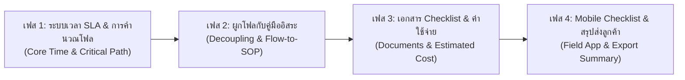

# 🗺️ Master Strategic Plan: การยกระดับระบบคู่มือปฏิบัติงาน (SOP) และผังโฟลงาน (Job Workflow)
**โครงการ: Asiathai Freight SOP & Workflow Management System**

เอกสารนี้รวบรวมบทวิเคราะห์จากการหารือ เพื่อวางแผนการพัฒนาอย่างเป็นระบบ แบ่งออกเป็น **4 เฟส (Phases)** ที่สามารถทยอยทำและใช้งานได้จริงโดยไม่กระทบระบบเดิม

---

## 🔍 บทวิเคราะห์ปัญหาและโจทย์การใช้งานจริง (Problem Analysis)

| ปัญหาหน้างานเดิม | ผลกระทบ | โซลูชันที่ระบบจะมอบให้ |
| :--- | :--- | :--- |
| **1. ไม่ทราบเวลาปฏิบัติงาน (No Time SLA)** | พนักงานกะเวลาไม่ถูก, เสี่ยงตกไฟลท์/ตัดรอบเรือ, ลูกค้าถามเวลาแล้วตอบไม่ได้ | ระบุเวลาประมาณการต่อขั้นตอน (Step SLA) และคำนวณเวลารวมทั้งกระบวนการอัตโนมัติ |
| **2. ความคิดติดกรอบต้องเขียนคู่มือก่อนผังงาน** | ทีมงานอยากร่างผังงานใหญ่ก่อน แต่ยังไม่มีเวลาทำคู่มือละเอียด ทำให้โฟลไม่คืบหน้า | **Decoupled Architecture**: ออกแบบให้เขียนโฟลอิสระได้ทันที แล้วมีปุ่มกดแปลงเป็นฉบับร่าง SOP ภายหลัง |
| **3. โฟลงานมีขั้นตอนคู่ขนาน (Parallel Tasks)** | รวมเวลาแบบบวกตรงๆ ไม่ได้ เพราะหน้างานทำพร้อมกัน 2 สาย | ใช้อัลกอริทึม **Critical Path Method (CPM)** คำนวณเฉพาะสายที่ใช้เวลานานที่สุดมาคิดเวลารวม |
| **4. ลืมเอกสาร / ไม่ทราบค่าใช้จ่ายหน้างาน** | เสียเวลาวิ่งกลับออฟฟิศ, เงินสำรองจ่าย (Cash Advance) ไม่พอ | กำหนด Document Checklist (Input/Output) และประมาณการค่าใช้จ่ายต่อขั้นตอน |

---

## 🚀 แผนการแบ่งเฟสการพัฒนา (Phased Roadmap)

---

### 🟢 เฟส 1: ระบบเวลา SLA & การคำนวณโฟลอัจฉริยะ (Core Time & Critical Path)
> **เป้าหมาย:** ให้ทุกขั้นตอนระบุเวลาได้ และผัง Mindmap คำนวณเวลารวมแบบคู่ขนานได้ทันที

#### สิ่งที่จะพัฒนา:
1. **Database Schema:**
   - เพิ่ม `estimated_minutes` (integer) ในตาราง `procedure_steps` (ขั้นตอนคู่มือ)
   - เพิ่ม `estimated_minutes` (integer) ในตาราง `job_workflow_steps` (ขั้นตอนโฟล)
2. **Backend API:**
   - สร้างฟังก์ชันคำนวณเวลาของโฟล:
     - คิดตาม **Critical Path (งานคู่ขนานคิดเส้นทางที่นานที่สุด)**
     - ฟอร์แมตเวลาออกมาในรูปแบบที่อ่านง่ายอัตโนมัติ เช่น `105 นาที` $\rightarrow$ `1 ชั่วโมง 45 นาที`
3. **Frontend UI:**
   - **Procedure View:** เพิ่ม Badge นาฬิกา `⏱️ ~15 นาที` ในแต่ละขั้นตอน และ Banner แสดงเวลารวมของคู่มือ
   - **Workflow Mindmap:**
     - เพิ่มแท็กเวลาบนการ์ดโหนดแต่ละใบ `⏱️ 30m`
     - เพิ่มแถบสรุปเวลารวมด้านบน เช่น `⏱️ เวลาโฟลประมาณการรวม: ~2 ชม. 30 นาที`
   - **Modal Form:** เพิ่มช่องกรอกเวลาในหน้าสร้าง/แก้ไขขั้นตอน

---

### 🟡 เฟส 2: การเชื่อมโยงโฟลและคู่มือแบบยืดหยุ่น (Decoupling & Flow-to-SOP Generator)
> **เป้าหมาย:** คนวางแผนสามารถร่างโฟลได้ทันทีโดยไม่ต้องรอคู่มือ พร้อมเครื่องมือช่วยสร้างคู่มืออัตโนมัติ

#### สิ่งที่จะพัฒนา:
1. **อิสระในการร่างโฟล (Drafting Flow without SOP):**
   - กล่องขั้นตอนในโฟลสามารถกรอกชื่อและเวลาได้เองโดยไม่ต้องเลือกคู่มือ
   - มี Tag กำกับสถานะที่การ์ด: `[📖 มีคู่มือแล้ว]` หรือ `[📝 ร่างอิสระ / รอเขียนคู่มือ]`
2. **Auto-sync เวลาจาก SOP:**
   - เมื่อเลือกผูกกับคู่มือ SOP ระบบจะดึงเวลาประมาณการของคู่มือนั้นมาใส่เป็น Default ให้ทันที
3. **ปุ่มมหัศจรรย์ "สร้างคู่มือจากโหนดในโฟล" (1-Click Flow-to-SOP):**
   - ที่การ์ดใน Mindmap มีปุ่ม `➕ สร้าง SOP จากขั้นตอนนี้`
   - ระบบจะเปิดหน้าต่างร่างคู่มือโดยดึงชื่อ, คำอธิบาย, และเวลาจากโฟลไปตั้งต้นให้ทันที เมื่อกดบันทึกจะผูกกลับมาที่โหนดเดิมอัตโนมัติ

---

### 🟠 เฟส 3: รายการเอกสารตรวจสอบ & ค่าใช้จ่ายประมาณการ (Checklist & Estimated Cost)
> **เป้าหมาย:** ป้องกันการลืมเอกสาร และช่วยให้ฝ่ายการเงินจัดเตรียมเงินทดรองจ่ายได้แม่นยำ

#### สิ่งที่จะพัฒนา:
1. **ระบบเอกสาร (Document Checklist):**
   - ระบุเอกสารที่ต้องเตรียมไป (Input Documents) เช่น B/L, D/O, Invoice
   - ระบุเอกสารที่จะได้รับกลับมา (Output Documents) เช่น ใบเสร็จการท่า, ใบตรวจปล่อย
2. **ระบบค่าใช้จ่าย (Estimated Cost):**
   - เพิ่มฟิลด์ `estimated_cost` (decimal) ต่อขั้นตอน (เช่น ค่าภาระท่าเรือ 500 บาท, ค่าตรวจตู้ 700 บาท)
   - แถบสรุปบนโฟลงานแสดงยอดเงินรวม: `💵 ประมาณการค่าใช้จ่ายรวม: ~1,200 บาท`

---

### 🔵 เฟส 4: โหมดพนักงานหน้างาน & สรุปส่งลูกค้า (Field Execution & Customer Sharing)
> **เป้าหมาย:** ใช้งานจริงผ่านสมาร์ตโฟนหน้างาน และส่งข้อมูลอัปเดตให้ลูกค้าได้อย่างมืออาชีพ

#### สิ่งที่จะพัฒนา:
1. **Interactive Field Mode (Mobile Friendly):**
   - หน้าจอมือถือสำหรับชิปปิ้งหน้างาน มี Checkbox ให้ติ๊กตรวจเอกสาร และติ๊กขั้นตอนที่ทำเสร็จแล้วทีละสเต็ป
2. **ปุ่มแชร์สรุปขั้นตอนส่งลูกค้า (Customer Summary / Export):**
   - ปุ่มคลิกเดียวสำหรับ Copy ข้อความสรุปกระบวนการ + เวลา + เอกสาร เพื่อส่งทาง LINE ให้ลูกค้าทราบสถานะล่วงหน้า
   - รองรับการ Export ผังงานหรือคู่มือเป็น PDF สวยงาม
